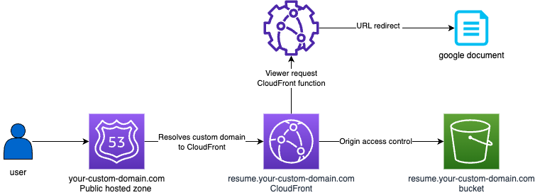

# Terraform Infrastructure Setup for Redirecting Custom Domain to Google Docs Resume

<div align="center">

  

  <h3 align="center">Movie Recommender App</h3>

</div>

## Overview

This repository provides a Terraform setup to redirect a custom domain to a Google Docs resume using AWS services. The solution involves configuring AWS CloudFront, Route 53, and S3 to handle redirection with Terraform automation.

## Architecture

The infrastructure consists of:

- **Route 53:** Resolves the custom domain to the CloudFront distribution.
- **CloudFront Distribution:** Manages the HTTPS connection and runs a CloudFront Function to issue the redirect.
- **S3 Bucket:** Acts as a minimal origin required by CloudFront, though no content is served from it.
- **CloudFront Function:** Redirects requests to the Google Docs resume link.

## Prerequisites

Before getting started, ensure you have:

- A registered custom domain (with AWS Route 53 or another registrar).
- A public Route 53 hosted zone set up in your AWS account.
- A publicly shareable Google Docs resume link.
- Terraform installed on your local machine.

## Getting Started

### Clone the Repository

```bash
git clone https://github.com/your-username/your-repo-name.git
cd your-repo-name
```

## Configure Your Variables

1. **Edit `terraform.tfvars`**

   Update the `terraform.tfvars` file with your domain information:

   - `root_domain`: Your main domain (e.g., `your-custom-domain.com`).
   - `resume_domain`: The subdomain for your resume (e.g., `resume.your-custom-domain.com`).

2. **Update `redirectToExternalSite.js`**

   Modify the `redirectToExternalSite.js` file to include the URL of your Google Docs resume. Locate the `google_form_url` variable and set it to your resume's public link:

## Run the Deployment

Execute the following script to initialize and apply the Terraform configuration:

```bash
chmod +x ./infrastructure/deploy.sh
./infrastructure/deploy.sh
```

This script will:

- Initialize Terraform.
- Apply the configuration to set up the necessary AWS resources.
